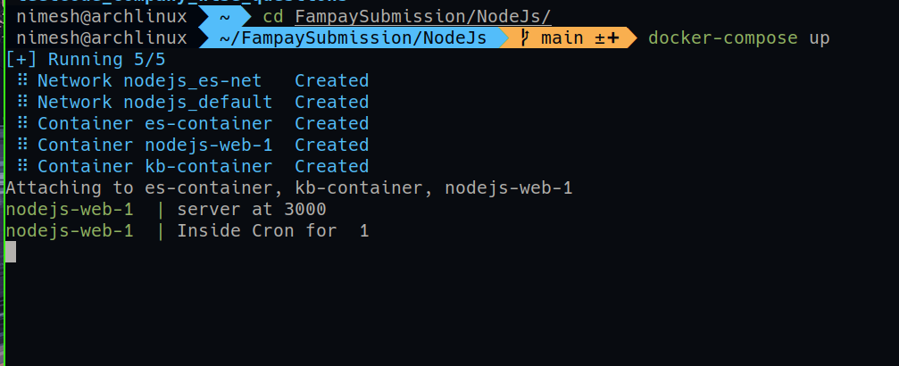
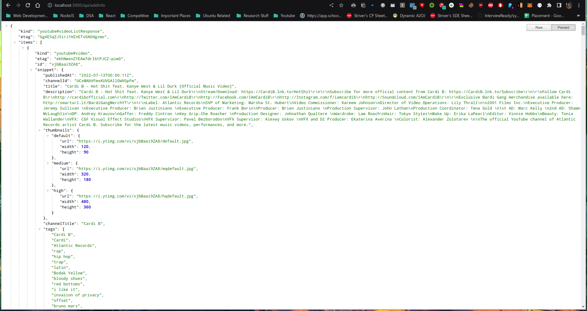
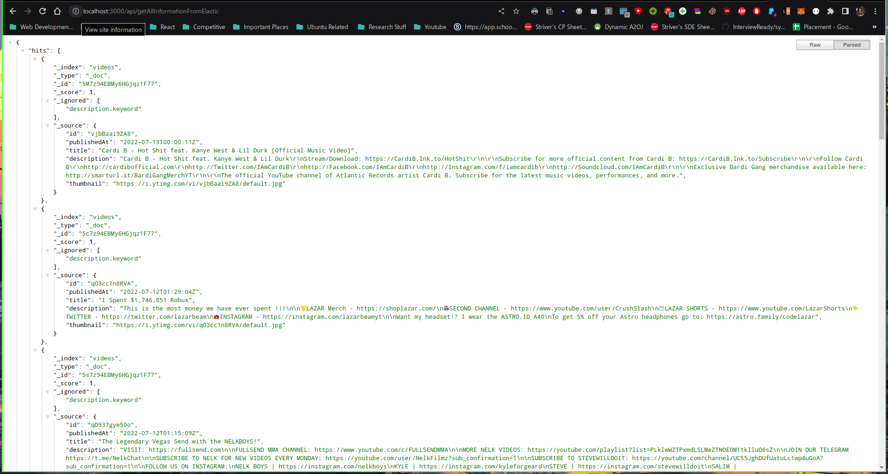
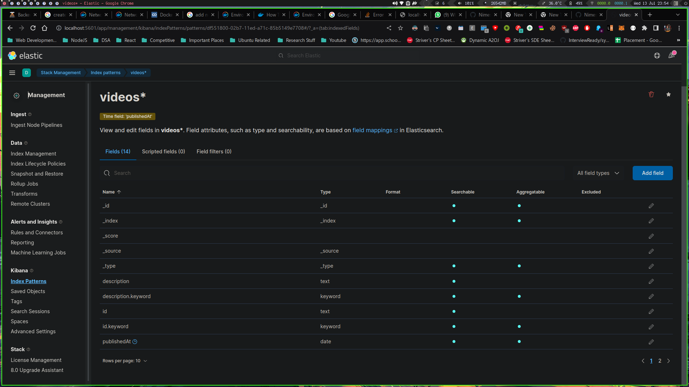
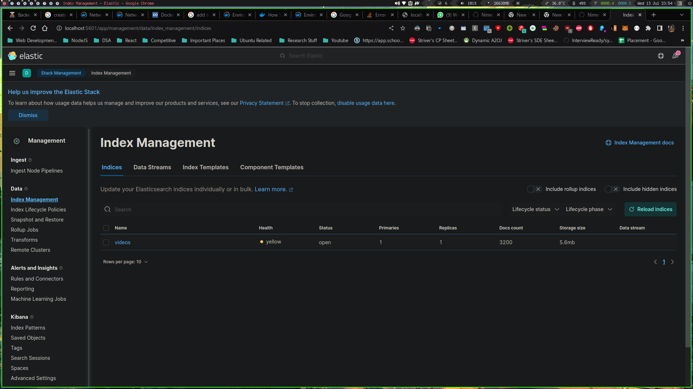

# Yt API Task

# Project Goal

To make an API to fetch latest videos sorted in reverse chronological order of their publishing date-time from YouTube for a given tag/search query in a paginated response.

# Basic Requirements:

- Server should call the YouTube API continuously in background (async) with some interval (say 10 seconds) for fetching the latest videos for a predefined search query and should store the data of videos (specifically these fields - Video title, description, publishing datetime, thumbnails URLs and any other fields you require) in a database with proper indexes.
- A GET API which returns the stored video data in a paginated response sorted in descending order of published datetime.
- A basic search API to search the stored videos using their title and description.
- Dockerize the project.
- It should be scalable and optimised.

# Bonus Points:

- Add support for supplying multiple API keys so that if quota is exhausted on one, it automatically uses the next available key.
- Make a dashboard to view the stored videos with filters and sorting options (optional)
- Optimise search api, so that it's able to search videos containing partial match for the search query in either video title or description.
  - Ex 1: A video with title _`How to make tea?`_ should match for the search query `tea how`

## API

- `GET` /api/addInfo
- Add Data to Elastic Search

- `GET` /api/getAllInformationFromElastic
- Returns Data from Elastic Search
- `GET` /api/query
- Query Params : queryString , pageNumber , pageSize ;
- Returns json and err with Status code 200
- `GET` /api/page
- Query Params : pageNumber , pageSize

# How to run

## Prereq : Docker and Compose should be installed

`git clone https://github.com/NimeshJohari02/Youtube-Api-Task`
`cd Youtube-Api-Task`
`docker-compose up`

## Images

### Project

# Tech Stack

        
        
        
        
        
        

# Reference:

- YouTube data v3 API: [https://developers.google.com/youtube/v3/getting-started](https://developers.google.com/youtube/v3/getting-started)
- Search API reference: [https://developers.google.com/youtube/v3/docs/search/list](https://developers.google.com/youtube/v3/docs/search/list)
- ElasticSearch node.js client: [https://www.elastic.co/guide/en/elasticsearch/client/javascript-api/current/index.html](https://www.elastic.co/guide/en/elasticsearch/client/javascript-api/current/index.html)
